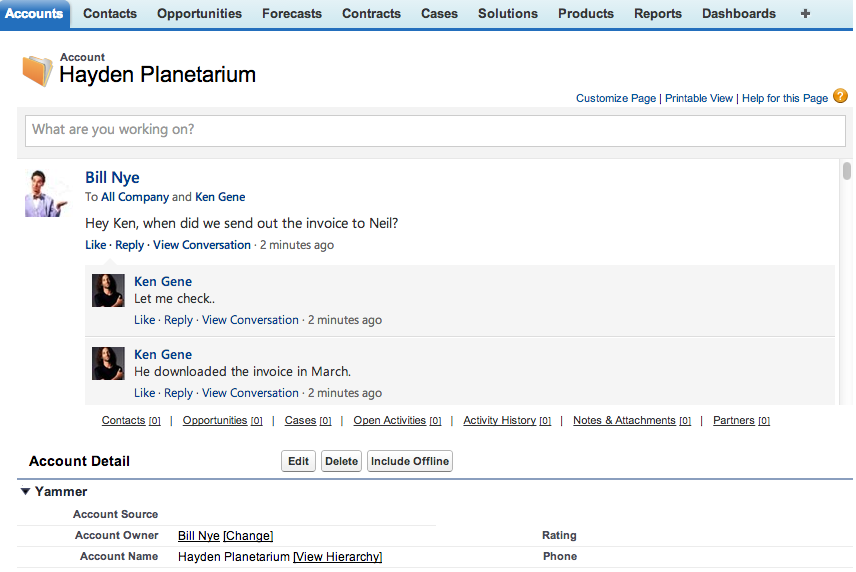

#Yammer anywhere in Salesforce.com
##Why? 

reword..

If your company has yammer and salesforce.com, this is relevant to you. Yammer has developed a very easy to integrate javascript sdk which allows you easily integrate any Yammer feed with very few lines of code. This is ideal for any company looking to make their internal software more tightly integrated. **internal user experience more tightly integrated**

reword..

The measure of an apps longevity nowadays relys on the applications' ability to be easily integrated. How well does it play with others (i.e. is there an API)!? Yammer does a great job enabling itself to be 'easily' integrated.

##Elephant in the room, Chatter
Isn't Yammer just like Chatter? Why do I need Chatter if I have Yammer? We aren't trying to answer all these questions, but there are some differences between the two architectures which are important to point out. 

Yammer is built around the idea of Users, Groups, and Feeds. A user belongs to many groups, which have their own individual feeds. Everyone belongs to the 'All Company' group by default. Our Yammer has Sales, Marketing, Accounting, and Engineering groups.

Salesforce (w/ Chatter) is composed of Users, Objects (fancy tables), Records, and Feeds. Salesforce specializes in CRM data and with chatter everything is related to a set of data or specific record. There is another layer of granularity with Chatter because it is designed within the *context* of CRM data. ..CONCLUSION NEEDED

Yammer is a great tool for promoting social interactions on your general business and specific departments/divisions of any business. The power of Yammer is in its simplicity. It does one thing, enable companies to be social about their business.

##The Story
+ Bill Nye, Science Guy has customers and partners. From Salesforce, Bill wants to check with his accountants (who use Yammer) to ensure that Neil Tyson received the invoice. He messages Ken Gene, accountanting department, "Hey Ken, when did we send out the invoice to Neil?"
+ Ken answers from Yammer, " Checking now.."
	+ "He downloaded the invoice in March"
+ ...

 

##Guide for setup
Technology opinions are everywhere! I like to hear peoples tool recommendations, so there'll be some speckled throughout the guide. We'll also be jumping back and forth between Yammer and Salesforce.com platforms, so I'll try to be explicit.

###Yammer signup
The first thing you need to [start is a Yammer domain](https://www.yammer.com/?return_home=true). We are assuming you already have this setup because Yammer checks your email address. "Only people with a verified company email address can join your company network." - Yammer
+ Log into your Yammer instance
+ Create a group, we'll use 'Accounting' as an example (we'll reference this group later)

Create a Yammer App
+ Navigate to 'Created Apps'
+ 'Register New App'
	+ App Name: salesforceyammin
	+ Organization: example llc
	+ Support email: help@examplellc.com
	+ Website: http://www.examplellc.com
+ Done!

We will need the Client ID when creating the html/scripts of our app in Salesforce later, so just keep it handy. In order to use the Yammer Embed API we'll have to put our specify our 'Javascript Origins' in the 'Basic Info' section of the app. We dont' know the urls yet, so we'll be coming back later.
 
Javascript Origins is for CORS. [CORS](http://www.html5rocks.com/en/tutorials/cors/) is an important part of the javascript sdk. TLDR; when using client side javascript to make callouts to external sources (XHR to Yammer API), the requested server has to be able to accept Cross-Origin requests. We won't go into more detail as it is out of the scope of this article.

Now we're ready to create a place for our Yammer application to live. On to Salesforce.com

###Salesforce setup
Create a new [salesforce instance (DE)](https://developer.salesforce.com/)
+ sign up -> fill out form -> sign me up

Or

+ use your existing Salesforce.com sandbox

####Salesforce setup

[Quick start VF page doc](http://www.salesforce.com/us/developer/docs/pages/Content/pages_quick_start_hello_world.htm)
 
[Full VF doc](http://www.salesforce.com/us/developer/docs/pages/index.htm)

#####Create Visualforce page
Once logged into your new Salesforce.com org
+ From the Salesforce UI
	+ Setup -> Create -> Visualforce
+ Our preffered Salesforce IDE [Mavens Mate for Sublime Text](http://mavensmate.com/)
	+ cmd+shift+p -> 'New Visualforce Page'
	+ Name it 'accountyammer'

Visualforce code:

		<apex:page showHeader="true" sidebar="true" standardController="Account" >
			Hello Visualforce
		</apex:page>

Preview the page in sfdc. https://SALESFORCE_DOMAIN.com/apex/accountyammer

####Yammer widget in Visualforce page
[Embed API ref](https://developer.yammer.com/connect/)

We have a Visualforce page setup, let's drop in our Yammer Embed widget. In your visualforce page, include the Yammer js sdk. The data-app-id is the public token genereated when you create your Yammer App. Find the Id through Yammer.com, Created Apps -> app_name -> Client Id.

		

The first thing to do after we have the widget is to authenticate with the Yammer servers. [Yammer Client-side OAuth 2](http://developer.yammer.com/authentication/#a-button)
		
		
		

Refresh your page in your browser. You should receive a javascript exception in your console (I'm testing with Chrome and Mac, so cmd+alt+j toggles the Javascript Console). The error should say that 'Allow-Access-Control-Origin'. This is the CORS I was mentioning above. To fix, define the salesforce domain in Javascript Origins portion of your Yammer App. (Ex: https://c.na15.visual.force.com/). Refresh and the error should be gone.
+ Created Apps -> My Apps -> sfdcyammin -> Basic Info -> Javascript Origins
+ https://c.na15.visual.force.com/

Add the html for the embed widget and the javascript to render your feed.
		
		
		

		...

Your Yammer feed should now load automatically, after you've logged in once through Yammer.

The Embed component works best with some limited context. It would be nice to see the feed while looking at an Account record in Salesforce.com. You can accomplish this with Visualforce pre-built components, specifically the ['detail' component](ref: https://www.salesforce.com/us/developer/docs/pages/Content/pages_compref_detail.htm). 
		
		<apex:detail subject="{!account.Id}" />

As of now we have a standalone page that just shows your yammer feed. We need to override the account object's 'view' to give the application a record's context with Yammer feed. In Salesforce.com:

+ Navigate to Setup -> Customize -> Accounts -> Buttons, Links, and Actions
+ Edit the action labeled 'View' 
+ Override with your Visualforce page, 'accountyammer'. Note: it is available in the drop down because we defined our Visualforce page to have the 'Account' as the standardController attribute.
+ If you don't have a record in the Account object, you can create one now. Navigate to the Accounts tab and click New.
+ Otherwise navigate to an Account record and you should see your Yammer feed 'embeded' in your Account detail page.
+ add collapsible
	+ //TBD

Your demo app is now complete. Yammer's API has a lot more to it then just the Embed widget. We think this is great start for anyone interested in breaking into Yammer development on the Salesforce platform. Happy coding.

##Gotchas of APIs
###Yammer
		//TBD